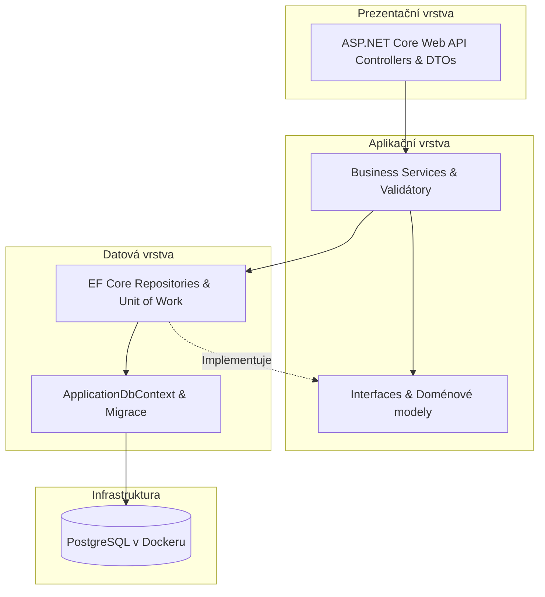
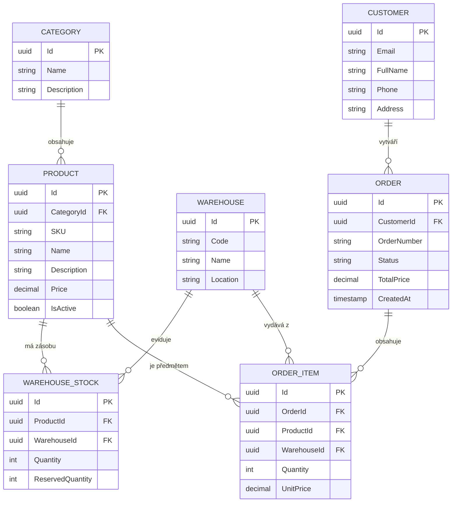

# Semestrální projekt PPRO: WarehouseHub (Sklad pro malý e-shop)

> **Předmět:** Pokročilé programování (PPRO) – Zimní semestr 2026/2027  
> **Fakulta:** Fakulta informatiky a managementu, Univerzita Hradec Králové (FIM UHK)  
> **Autor:** Jaroslav Drago (`tehnija1`, GitHub: [SeaSharpGlass](https://github.com/SeaSharpGlass))  
> **Vyučující:** Dominik Palla (`dominik.palla@uhk.cz`)  
> **Zvolené zadání:** Zadání B – Sklad pro malý e-shop  
> **Termín odevzdání:** 31. 12. 2026  

---

## 1. O projektu & Single Source of Truth

Tento dokument (`README.md`) slouží jako **živý zdroj pravdy (Single Source of Truth)** pro technickou specifikaci, architekturu, evidenci architektonických rozhodnutí (ADR) a návod ke spuštění aplikace. Obsah je průběžně aktualizován před každým commitem a slouží jako podklad pro finální technickou dokumentaci v `docs/`.

Pravidla pro vývoj a práci s AI agentem jsou definována v souboru [AGENTS.md](file:///u:/ppro2026/AGENTS.md).

---

## 2. Zvolené zadání & Doménová pravidla

### 2.1 Kontext klienta (Zadání B)
E-shop přerostl původní evidenci v tabulkovém procesoru (Excel). Roste počet objednávek, skladových položek i počet fyzických skladů. Klient potřebuje robustní systém pro správu produktů, skladových zásob a vyřizování zákaznických objednávek s garancí skladové konzistence.

### 2.2 Klíčové business požadavky
1. **Hierarchie produktů a kategorií:** Produkty jsou jednoznačně zařazeny do kategorií.
2. **Víceskladové hospodářství:** Evidovat stav zásob konkrétních produktů na více samostatných skladech.
3. **Objednávky zákazníků s více položkami:** Objednávka se skládá z libovolného počtu různých produktů a jejich množství (vazba M:N).
4. **Validace dostupnosti zásob (Kritické pravidlo):** Systém **musí striktně odmítnout** objednávku (nebo její položku), pro kterou není na skladech dostatečné množství volných zásob.
5. **Dohledatelnost výdeje (Auditovatelnost):** Pro každou expedovanou položku objednávky musí být jednoznačně dohledatelné, ze kterého konkrétního skladu byla vyskladněna.

---

## 3. Technologický stack

| Komponenta | Technologie | Důvod volby |
|---|---|---|
| **Platforma & Jazyk** | C# / .NET 10 | Silně typovaný jazyk, vysoký výkon, moderní jazykové konstrukce a robustní ekosystém. |
| **Aplikační framework** | ASP.NET Core Web API | Špičková podpora pro tvorbu RESTful rozhraní, DI kontejneru a middleware. |
| **ORM & Migrace** | Entity Framework Core (EF Core) | Podpora Code-First přístupu s verzovanými migracemi a silně typovaným dotazováním. |
| **Databáze** | PostgreSQL 16 (v Dockeru) | Osvědčená open-source relační databáze s plnou ACID podporou a transakční integritou. |
| **Kontejnerizace** | Docker & Docker Compose | Zajištění jednokrokového a opakovatelného spuštění celé aplikace i databáze. |
| **Testování** | xUnit + FluentAssertions + Testcontainers | Průmyslový standard pro spolehlivé jednotkové a integrační testy proti reálné DB. |

---

## 4. Architektura systému (Třívrstvá architektura)

Aplikace striktně odděluje zodpovědnosti do tří vrstev se striktně jednosměrným tokem závislostí:



### Pravidla vrstev:
1. **Prezentační vrstva (Controllers):** Přejímá HTTP požadavky, provádí základní formátovou validaci DTOs a deleguje volání do aplikačních služeb. Nikdy nepřistupuje přímo k databázi ani neobsahuje SQL/EF dotazy.
2. **Aplikační vrstva (Business Logic):** Realizuje doménová pravidla (kontrola skladových zásob, rezervace zboží, kalkulace objednávky, přiřazení skladu pro výdej). Řídí transakční hranice.
3. **Datová vrstva (Data Access / Persistence):** Implementuje repozitáře, zapouzdřuje `DbContext`, mapuje entity a provádí verzované databázové migrace.

---

## 5. Datový model

Datový model obsahuje **7 entit** a **dvě explicitní vazby M:N**, čímž plně překračuje povinné minimum (min. 5 entit, 1 vazba M:N):



### Popis klíčových entit a vazeb:
- **`Category` (Kategorie):** Číselník kategorií pro kategorizaci produktů (1:N s `Product`).
- **`Product` (Produkt):** Zboží nabízené v e-shopu (cena, SKU, název).
- **`Warehouse` (Sklad):** Fyzické skladovací prostory klienta.
- **`WarehouseStock` (Skladová zásoba – Vazba M:N mezi `Product` a `Warehouse`):** Eviduje aktuální počet kusů daného produktu na konkrétním skladu a rezervované množství.
- **`Customer` (Zákazník):** Odběratel (pouze syntetická testovací data).
- **`Order` (Objednávka):** Hlavička objednávky evidující zákazníka, celkovou částku, čas vytvoření a stav (např. *Draft*, *Confirmed*, *Dispatched*, *Cancelled*).
- **`OrderItem` (Položka objednávky – Vazba M:N mezi `Order` a `Product`):** Spojovací entita objednávky a produktu uchovávající počet kusů, historickou jednotkovou cenu v době nákupu a **odkaz na `WarehouseId`**, ze kterého bylo/bude zboží expedováno (splnění podmínky dohledatelnosti).

---

## 6. Seznam architektonických rozhodnutí (ADR)

| ID | Datum | Kontext | Rozhodnutí | Důvod & Důsledky |
|---|---|---|---|---|
| **ADR-001** | 2026-09-30 | Nastavení workflow a pravidel AI agenta | Vytvořen [AGENTS.md](file:///u:/ppro2026/AGENTS.md). Zavedena povinnost commitovat vždy s `-m`, striktní zákaz auto-push bez explicitního pokynu a dokumentační brána před commitem. | Zajišťuje plnou kontrolu studenta nad repozitářem a plnění podmínek sylabu PPRO. |
| **ADR-002** | 2026-09-30 | Vytvoření technické dokumentace projektu | `README.md` je ustanoven jako živý Single Source of Truth. | Zaručuje konzistenci technických informací v čase před každým commitem a slouží jako podklad pro PDF zprávu. |
| **ADR-003** | 2026-09-30 | Ochrana citlivých údajů | Založen [.gitignore](file:///u:/ppro2026/.gitignore) zakazující sledování `.env` souborů a dočasných artefaktů. | Splnění bezpečnostního požadavku zadání (žádná hesla ani privátní data v repozitáři). |
| **ADR-004** | 2026-09-30 | Výběr semestrálního zadání | Zvoleno **Zadání B: Sklad pro malý e-shop**. | Zadání má přirozený doménový model, logické M:N relace a reálná business pravidla (kontrola zásob a audit výdeje). |
| **ADR-005** | 2026-09-30 | Volba technologického stacku | Zvolen **C# / .NET 10 + EF Core + PostgreSQL v Dockeru**. | Standardní podnikový stack odpovídající profilu předmětu, robustní migrační nástroje a podpora kontejnerizace. |
| **ADR-006** | 2026-09-30 | Příprava klientského rozhraní a implementační roadmapy | Vytvořen 8fázový implementační plán a samostatné klientské drátové demo v HTML/CSS/JS pro entitu `Product`. | Umožňuje předvést klientovi UX a simulaci klíčových business pravidel (odmítnutí objednávky při nedostatku zásob) ještě před backendovou implementací. |

---

## 7. Návod ke spuštění (Getting Started)

### 7.1 Klientské drátové demo (Jediná entita: Produkt)
Pro okamžitou klientskou prezentaci bez nutnosti instalace databáze:
- Otevřete soubor [demo/index.html](file:///u:/ppro2026/demo/index.html) přímo ve vašem webovém prohlížeči (např. Google Chrome nebo Microsoft Edge), nebo v terminálu spusťte:
  ```powershell
  Start-Process "u:\ppro2026\demo\index.html"
  ```
- **Funkce dema:**
  - **Modul Produkty & Zásoby:** Plná správa produktů (přidání, editace, smazání, fulltextové vyhledávání, filtrace dle kategorie a dle konkrétního skladu). Rychlé naskladnění / vyskladnění (`+1 ks` / `-1 ks`) s validací nezápornosti zásob.
  - **Modul Sklady (3 lokace dle Zadání B):** Samostatný interaktivní pohled na víceskladové hospodářství:
    * Karty 3 fyzických skladů: **Centrální sklad Praha (W-PRG)**, **Regionální sklad Brno (W-BRN)**, **Distribuční centrum Ostrava (W-OST)** s metrikami počtu položek, fyzické zásoby, hodnoty a ukazatele využití kapacity.
    * Rozpad skladových zásob (vazba M:N `WarehouseStock`): rozlišení celkové fyzické zásoby (`Quantity`), rezervovaného množství (`ReservedQuantity`) a volného množství k okamžitému výdeji.
    * Rychlé úpravy skladového stavu přímo pro konkrétní zvolený sklad.
    * **Meziskladový převod zboží:** Funkce přesunu kusů mezi libovolnými sklady s automatickou validací dostupné volné zásoby na zdrojovém skladu.
  - Tlačítko **"Simulovat nákup klienta"** demonstrující klíčová doménová pravidla:
    * *Úspěšné vyskladnění* s uvedením konkrétního skladu, ze kterého se zboží vydalo.
    * *Striktní odmítnutí objednávky*, pokud skladové zásoby nestačí.

### 7.2 Backend & Databáze (PostgreSQL v Dockeru)
```bash
# 1. Klonování repozitáře
git clone https://github.com/SeaSharpGlass/ProjektSchool.git
cd ProjektSchool

# 2. Vytvoření lokální konfigurace
cp .env.example .env

# 3. Spuštění kontejnerů (databáze + migrace + aplikace)
docker compose up -d --build

# 4. Dostupnost služeb
# - API & Swagger / OpenAPI: http://localhost:5000/swagger
# - Databáze PostgreSQL: localhost:5432 (databáze: warehouse_db)
```

---

## 8. Testování

- **Jednotkové testy (Unit Tests):** Testují validační pravidla odmítnutí objednávky při nedostatku skladových zásob a logiku kalkulace.
- **Integrační testy (Integration Tests):** Testují transakční zápis objednávky, odečet zásob ze skladu a dohledatelnost výdeje proti reálné PostgreSQL databázi.

Spuštění testů:
```bash
dotnet test
```

---

## 9. Historie vývoje & Changelog

- **2026-10-07:**
  - Implementace samostatného modulu **Sklady (3 lokace)** dle Zadání B (Centrální sklad Praha W-PRG, Regionální sklad Brno W-BRN, Distribuční centrum Ostrava W-OST).
  - Vytvoření přehledových karet skladů s ukazateli zaplnění kapacity, počtu položek a celkové hodnoty zboží na skladě.
  - Detailní zobrazení vazby M:N (`WarehouseStock`) s evidencí fyzické zásoby, rezervovaného množství a volných kusů k výdeji.
  - Přidán filtr podle skladu do katalogu produktů a interaktivní dialog meziskladových převodů zboží (Transfer modal).
  - Rozšíření klientského dema: přidáno rychlé akční tlačítko `-1 ks` vedle `+1 ks` v tabulce produktů s ochranou proti záporným zásobám.
- **2026-09-30 (1. cvičení):**
  - Inicializace Git repozitáře na větvi `main`.
  - Propojení s remote repozitářem na GitHubu ([SeaSharpGlass/ProjektSchool](https://github.com/SeaSharpGlass/ProjektSchool)).
  - Vytvoření konfiguračních pravidel agenta v [AGENTS.md](file:///u:/ppro2026/AGENTS.md) a nastavení [.gitignore](file:///u:/ppro2026/.gitignore).
  - Výběr **Zadání B: Sklad pro malý e-shop** a technologického stacku **.NET / C# + PostgreSQL**.
  - Zpracování detailního návrhu doménového a relačního modelu (7 entit, 2 vazby M:N) a třívrstvé architektury v [README.md](file:///u:/ppro2026/README.md).
  - Zpracování 8fázového implementačního plánu semestrálního projektu.
  - Vytvoření interaktivního klientského drátového dema pro správu entity `Product` ([demo/index.html](file:///u:/ppro2026/demo/index.html), [demo/style.css](file:///u:/ppro2026/demo/style.css), [demo/app.js](file:///u:/ppro2026/demo/app.js)).

---

## 10. Záznamy pro technickou dokumentaci (docs/)

### 10.1 Přiznání práce s AI
- **Nástroj:** Google Antigravity (Gemini 3.8 Flash)
- **Rozsah použití:** Konzultace výběru zadání, návrh datového modelu a ER diagramu, strukturování technické dokumentace a ADR, sestavení harmonogramu fází a tvorba klientského wireframe prototypu.
- **Verifikace:** Návrh modelu a business logiky byl zkontrolován studentem a ověřen vůči povinnému minimu sylabu PPRO.

### 10.2 Protokol o zacyklení a selhání agenta
- **Incident 1 (Chybějící PATH a safe.directory):** Při prvotní inicializaci nebyl Git v globální `PATH` a síťový disk `U:` hlásil `dubious ownership`. Situace byla vyřešena nalezením Git binárky ve Visual Studiu, nastavením proměnné prostředí a konfigurací `safe.directory` v Gitu.
- **Incident 2 (Headless blokace Git Credential Manageru při `git push`):** Při pokusu o spuštění `git push` z background subshellu se proces zablokoval bez výstupu. Příčina: Git Credential Manager v neinteraktivním subshellu agenta nemohl zobrazit přihlašovací dialog k účtu GitHub (`fatal: could not read Username: terminal prompts disabled`). Řešení: Jednorázové spuštění `git push` studentem v interaktivním terminálu pro uložení tokenu do Windows Credential Manageru.
- **Incident 3 (Selhání inicializace interního prohlížeče Playwright):** Při snaze automaticky zvalidovat vzhled dema přes `browser_subagent` selhal nástroj `open_browser_url`, protože CDN Playwright vrátila HTTP 404 pro ovladač `playwright-1.57.0-win32_x64.zip`. Řešení: Otevření a testování dema přímo v systémovém prohlížeči uživatele (Chrome / Edge).