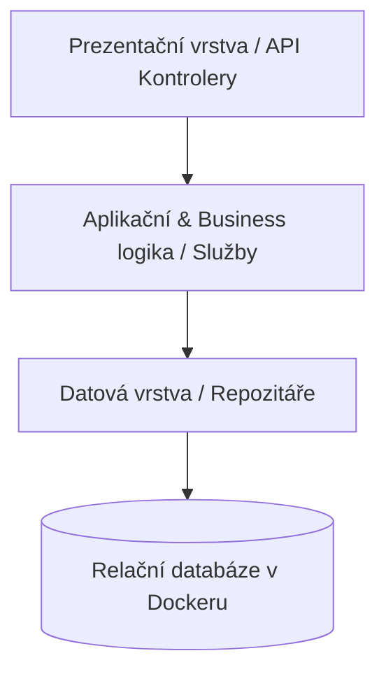

# Semestrální projekt PPRO: ProjektSchool

> **Předmět:** Pokročilé programování (PPRO) – Zimní semestr 2026/2027  
> **Fakulta:** Fakulta informatiky a managementu, Univerzita Hradec Králové (FIM UHK)  
> **Autor:** Jaroslav Drago (`tehnija1`, GitHub: [SeaSharpGlass](https://github.com/SeaSharpGlass))  
> **Vyučující:** Dominik Palla (`dominik.palla@uhk.cz`)  
> **Termín odevzdání:** 31. 12. 2026  

---

## 1. O projektu & Single Source of Truth

Tento dokument (`README.md`) slouží jako **živý zdroj pravdy (Single Source of Truth)** pro technickou specifikaci, architekturu, evidenci architektonických rozhodnutí (ADR) a návod ke spuštění aplikace. Obsah je průběžně aktualizován před každým commitem a slouží jako podklad pro finální technickou dokumentaci v `docs/`.

Pravidla pro vývoj a práci s AI agentem jsou definována v souboru [AGENTS.md](file:///u:/ppro2026/AGENTS.md).

---

## 2. Výběr zadání

*Aktuální stav: Výběr zadání probíhá.*

Podle oficiálního zadání PPRO jsou k dispozici 4 varianty pokrývající povinné minimum (min. 5 entit, alespoň jedna vazba M:N):

| Varianta | Název | Klíčové entity & M:N vazba | Specifika klienta |
|---|---|---|---|
| **A** | **Rezervace v ordinaci** | Pacient, Lékař, Ordinační hodiny, Návštěva/Rezervace, Výkon<br>*(M:N Návštěva ↔ Výkon)* | Přehled volných termínů lékaře, zákaz duplicitních rezervací na shodný čas, opakované návštěvy a výkony. |
| **B** | **Sklad pro malý e-shop** | Produkt, Kategorie, Sklad, Skladová zásoba, Objednávka, Položka objednávky<br>*(M:N Produkt ↔ Objednávka)* | Zákaz objednávky při nedostatku zásob, dohledatelnost výdeje z konkrétního skladu. |
| **C** | **Kurzy vzdělávacího centra** | Kurz, Lektor, Termín kurzu, Student, Zápis/Pořadník<br>*(M:N Student ↔ Termín)* | Hlídání kapacity termínu, automatický pořadník při naplnění, evidence dokončení kurzu. |
| **D** | **Půjčovna vybavení** | Vybavení, Kategorie, Kus (fyzický exemplář), Zákazník, Výpůjčka, Rezervace<br>*(M:N Výpůjčka ↔ Kus)* | Přehled aktuálně zapůjčených kusů a termínů vrácení, rezervace předem, zákaz kolizí výpůjček. |

---

## 3. Architektura a principy návrhu

Aplikace striktně dodržuje **třívrstvou architekturu** s jednosměrným tokem závislostí:



### Pravidla vrstev:
1. **Prezentační vrstva:** Přijímá požadavky, validuje vstupní DTO, volá aplikační služby a vrací odpověď. Nesmí obsahovat business logiku ani SQL dotazy.
2. **Aplikační vrstva:** Obsahuje veškerou doménovou logiku, validační a rozhodovací pravidla. Řídí transakce. Nemá přímou vazbu na HTTP kontext.
3. **Datová vrstva:** Poskytuje abstrakci nad databázovým úložištěm přes rozhraní repozitářů. Přístup k DB je řízen migracemi.

---

## 4. Datový model

*(Bude doplněn konkrétní ER diagram po výběru zadání)*

- **Požadavek na entity:** Minimálně 5 doménových entit.
- **Vazba M:N:** Alespoň jedna explicitní vazba N:M reprezentovaná spojovací tabulkou s doplňkovými atributy.
- **Migrace:** Verzované migrační skripty spravující schéma databáze.

---

## 5. Seznam architektonických rozhodnutí (ADR)

| ID | Datum | Kontext | Rozhodnutí | Důvod & Důsledky |
|---|---|---|---|---|
| **ADR-001** | 2026-09-30 | Nastavení workflow a pravidel AI agenta | Vytvořen [AGENTS.md](file:///u:/ppro2026/AGENTS.md). Zavedena povinnost commitovat vždy s `-m`, striktní zákaz auto-push bez explicitního pokynu, a dokumentační brána před commitem. | Zajišťuje plnou kontrolu studenta nad repozitářem a plnění podmínek sylabu PPRO. |
| **ADR-002** | 2026-09-30 | Vytvoření technické dokumentace projektu | `README.md` je ustanoven jako živý Single Source of Truth. | Zaručuje konzistenci technických informací v čase před každým commitem a slouží jako podklad pro PDF zprávu. |
| **ADR-003** | 2026-09-30 | Ochrana citlivých údajů | Založen [.gitignore](file:///u:/ppro2026/.gitignore) zakazující sledování `.env` souborů a dočasných artefaktů. | Splnění bezpečnostního požadavku zadání (žádná hesla ani privátní data v repozitáři). |

---

## 6. Návod ke spuštění (Getting Started)

### Prerekvizity
- Docker & Docker Compose
- Git

### Postup spuštění
*(Bude zkompletováno spolu s implementací `docker-compose.yml`)*
```bash
# 1. Klonování repozitáře
git clone https://github.com/SeaSharpGlass/ProjektSchool.git
cd ProjektSchool

# 2. Vytvoření lokální konfigurace
cp .env.example .env

# 3. Spuštění kontejnerů
docker compose up -d
```

---

## 7. Testování

- **Jednotkové testy (Unit Tests):** Testují doménová pravidla a aplikační logiku izolovaně od databáze.
- **Integrační testy (Integration Tests):** Testují přístup k datům a transakční integritu proti reálné instanci databáze.

---

## 8. Historie vývoje & Changelog

- **2026-09-30 (1. cvičení):**
  - Inicializace Git repozitáře na větvi `main`.
  - Propojení s remote repozitářem na GitHubu ([SeaSharpGlass/ProjektSchool](https://github.com/SeaSharpGlass/ProjektSchool)).
  - Vytvoření konfiguračních pravidel agenta [AGENTS.md](file:///u:/ppro2026/AGENTS.md) a nastavení `.gitignore`.
  - Vytvoření živého technického dokumentu a přehledu zadání v [README.md](file:///u:/ppro2026/README.md).

---

## 9. Záznamy pro technickou dokumentaci (docs/)

### 9.1 Přiznání práce s AI
- **Nástroj:** Google Antigravity (Gemini 3.8 Flash)
- **Rozsah použití:** Asistence s architekturou, šablonami dokumentace a pravidly workflow.
- **Verifikace:** Veškerá pravidla a texty dokumentace zkontrolovány a odsouhlaseny studentem.

### 9.2 Protokol o zacyklení a selhání agenta
- *Při prvotní inicializaci nebyl Git v globální `PATH` a síťový disk `U:` hlásil `dubious ownership`. Situace byla vyřešena nalezením Git binárky ve Visual Studiu, nastavením proměnné prostředí a konfigurací `safe.directory` v Gitu.*